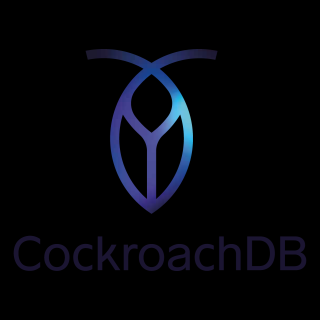

# Lucee CockroachDB JDBC Extension

Issues: https://luceeserver.atlassian.net/issues/?jql=labels%20%3D%20cockroachdb

## Coackroach DB

https://www.cockroachlabs.com/product/overview/

## JDBC client

While you can just use the Postgres JDBC client, this JDBC client adds some extra Cockroachdb specific support (it does bundle the postgres jdbc client and extends it)

https://github.com/cloudneutral/cockroachdb-jdbc

## Requirements

**Java 17 or higher** is required for this extension due to the CockroachDB JDBC driver 2.0.1+ dependency.
**Lucee 6.2.2.91 or newer**
